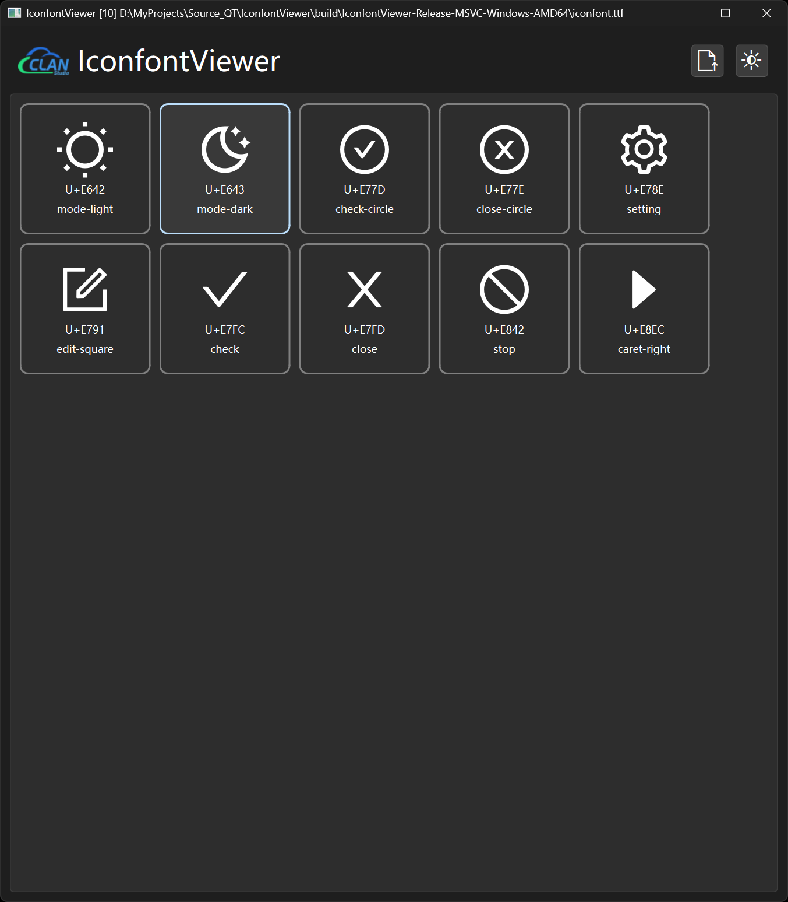
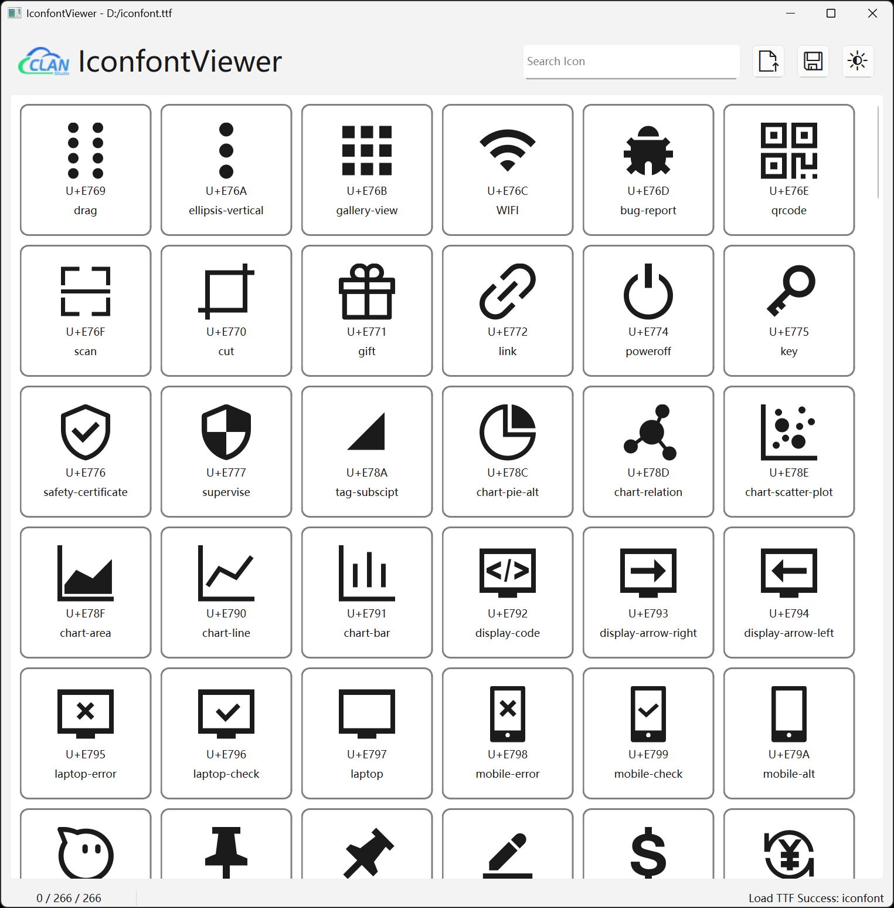

# IconfontViewer

一个用Qt编写的TTF图标字体查看器，可以方便地浏览和管理TTF字体文件中的图标。





## 功能特性

- **TTF字体预览**：加载和显示TTF字体文件中的所有图标
- **直观的网格布局**：以网格形式展示字体中的所有图标
- **双击复制**：双击图标可以复制其Unicode码点到剪贴板
- **拖拽支持**：支持拖拽TTF文件到应用窗口中直接加载
- **主题切换**：支持浅色/深色主题切换
- **详细信息**：显示每个图标的名称和Unicode码点

## 系统要求

- Qt 6.9.3 或更高版本
- C++20 编译器
- FreeType 库

## 构建依赖

- Qt6 (Core, Gui, Widgets)
- FreeType
- Conan2

## 构建方法

```bash
# 创建构建目录
mkdir build
cd build

# 配置项目 (使用CMake)
cmake .. -DCMAKE_BUILD_TYPE=Release -DCMAKE_TOOLCHAIN_FILE=conan_toolchain.cmake

# 编译项目
cmake --build . --config Release
```

## 使用方法

1. 启动应用程序
2. 点击"Load"按钮或拖拽TTF文件到窗口中加载字体
3. 应用程序将显示字体中的所有图标
4. 双击图标可复制其Unicode码点到剪贴板
5. 点击主题切换按钮可在浅色/深色模式间切换

## 技术细节

- 使用FreeType库解析TTF文件
- 通过Qt的字体系统渲染图标
- 实现了自定义的列表项以显示字体图标
- 支持拖拽操作和主题切换

## 文件结构

- `mainwindow.*` - 主窗口界面和逻辑
- `TtfFontItem.*` - 字体图标的显示组件
- `ttfparser.*` - TTF文件解析器
- `CMakeLists.txt` - CMake构建配置
- `res.qrc` - Qt资源文件

## 许可证

该项目遵循MIT许可证（如无特殊声明）。